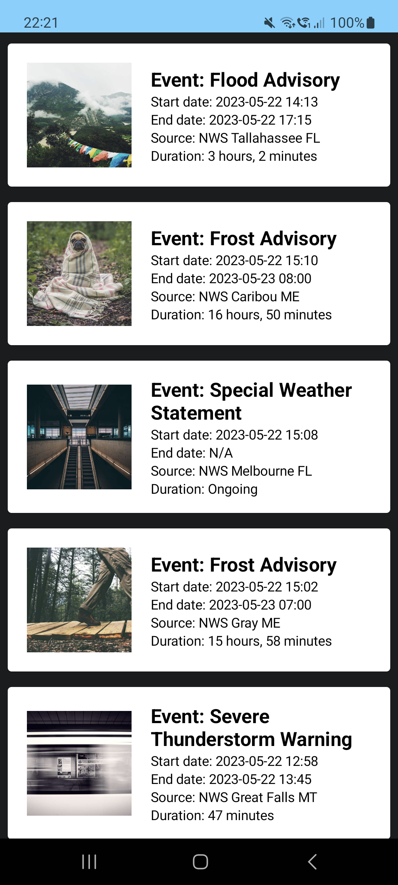

# WeatherAlerts App - Demo Project

Welcome to the WeatherAlerts App! This is a demo project showcasing Android architecture, clean code principles, and design patterns. The app follows the MVVM architecture with separation of concerns and utilizes Jetpack Compose for the UI layer.

## Features

- Displays current active weather alerts in the US
- Retrieves alert data from the National Weather Service API
- Shows event name, start date, end date, source, and duration for each alert
- Fetches a unique random image for each alert from the Picsum API
- Images remain consistent even when scrolling back to the same alert

## Architecture and Design Patterns

The WeatherAlerts App demonstrates the following architecture and design patterns:

- MVVM (Model-View-ViewModel) architecture: Separates the UI, business logic, and data handling.
- Clean code principles: Emphasizes readability, maintainability, and testability through proper code organization and naming conventions.
- Single Responsibility Principle: Each component is responsible for a single task or functionality.
- Domain layer: Encapsulates complex business logic and promotes reusability.
- Dependency Injection: Utilizes Hilt for dependency injection, enabling modular and testable code.

## Getting Started

To run the WeatherAlerts App on your local machine, follow these steps:

1. Clone the repository: `git clone https://github.com/lexteodorovici/weatheralerts.git`
2. Open the project in Android Studio.
3. Build and run the app on an emulator or physical device.

## External Libraries

The WeatherAlerts App utilizes the following external libraries:

- Retrofit: For performing network requests and API communication.
- Moshi: For JSON parsing and serialization.
- Jetpack Compose: For building the UI using modern Android UI toolkit.
- Hilt: For dependency injection and managing app-level dependencies.

## Feedback and Support

If you have any feedback, suggestions, or questions related to the WeatherAlerts App, please feel free to reach out to me at [hello@alexteodorovici.com].

Thank you for checking out this demo project! It serves as an example of implementing Android architecture and clean code practices.

